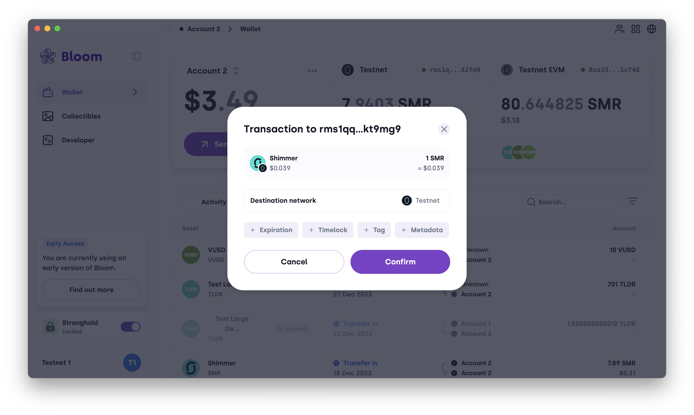

# Wallet

`bloom://wallet`

## Send Transaction

`bloom://wallet/sendTransaction`

This operation brings the user to the send confirmation popup:

:::image

:::

### Parameters

| Parameter                 | Description                                                                                                                                  | Type             | Required                                      |
| ------------------------- | -------------------------------------------------------------------------------------------------------------------------------------------- | ---------------- | --------------------------------------------- |
| `address`                 | A layer 1 address to send an asset to                                                                                                        | Bech32Address    | True                                          |
| `baseCoinAmount`          | The amount of the base coin to be sent                                                                                                       | Integer          | Required if `tokenAmount` is NOT specified    |
| `tokenAmount`             | The amount of a specific token to be sent                                                                                                    | Integer          | Required if `baseCoinAmount` is NOT specified |
| `tokenId`                 | ID of the token to be sent                                                                                                                   | HexEncodedString | Required if `tokenAmount` is specified        |
| `tag`                     | An optional data field to tag outputs with an index                                                                                          | HexEncodedString | False                                         |
| `metadata`                | An optional field that is interpreted by higher layer applications                                                                           | HexEncodedString | False                                         |
| `giftStorageDeposit`      | An optional field to remove the Storage Deposit Return unlock condition (which may be added by Bloom for dust and native token transactions) | Boolean          | False                                         |
| `disableToggleGift`       | A flag to prevent users changing the gift storage deposit field manually                                                                     | Boolean          | False                                         |
| `disableChangeExpiration` | A flag to prevent users changing the expiration unlock field manually                                                                        | Boolean          | False                                         |
| `disableChangeTimelock`   | A flag to prevent users changing the timelock unlock field manually                                                                          | Boolean          | False                                         |

### Link

The deep link structure is as follows:

```
bloom://wallet/sendTransaction?address=<Bech32Address>[&baseCoinAmount=<Integer>][&tokenId=<HexEncodedString>&tokenAmount=<Integer>][&tag=<HexEncodedString>][&metadata=<HexEncodedString>][&giftStorageDeposit=<Boolean>][&disableToggleGift=<Boolean>][&disableChangeExpiration=<Boolean>][&disableChangeTimelock=<Boolean>]
```

Example: Send 1 SMR to

```
bloom://wallet/sendTransaction?address=rms1qqu5pw3t73j3d774ss7dvg6s7jk349xn7u7q48z5mkja3942uwewqkt9mg9&baseCoinAmount=1000000
```

Test:

[!button Bloom - Alpha](bloom://wallet/sendTransaction?address=rms1qqu5pw3t73j3d774ss7dvg6s7jk349xn7u7q48z5mkja3942uwewqkt9mg9&baseCoinAmount=1000000) [!button Bloom - Beta](bloom-beta://wallet/sendTransaction?address=rms1qqu5pw3t73j3d774ss7dvg6s7jk349xn7u7q48z5mkja3942uwewqkt9mg9&baseCoinAmount=1000000) [!button Bloom](bloom://wallet/sendTransaction?address=rms1qqu5pw3t73j3d774ss7dvg6s7jk349xn7u7q48z5mkja3942uwewqkt9mg9&baseCoinAmount=1000000)

<style>
  .image {
    margin: auto;
  }
</style>

```

```
