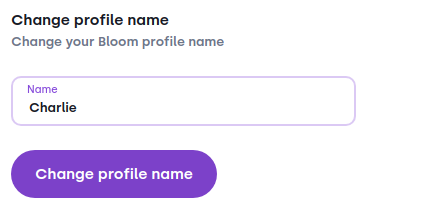
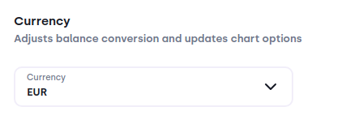
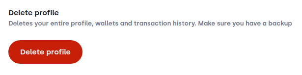

# Profile
In this section you will find settings relevant for the whole profile, overarching all wallets.

### Profile name
:::image

:::

This is used to customize your profile. The profile name helps you identifying the correct profile if you have multiple seed phrases registered in your Bloom wallet. 

### Currency
:::image

:::

With this setting you dictate which currency is used across the whole app if Bloom displays the fiat value for an asset.

### Delete profile
:::image

:::

Deleting a profile means that you will not be able to access it afterwards. This will remove the profile from the profile selection and all its files and data.
**Important**: This action is irreversible. If you don't have access to your seed phrase or to a recent `.stronghold` file, you will lose access to your funds. Make sure to double check on the avaiability to those beforehand!