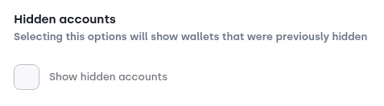
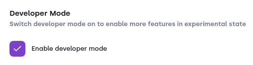

# Advanced

### Hidden Accounts
:::image

:::
By enabling this setting, accounts you previously hid with the `Hide account` functionality (reference to guide TODO), are again displayed across your wallet.

### Developer Mode
:::image

:::

By enabling the developer mode, you get access to the `Developer` tab in the menu sidebar (reference to developer tools guide TODO).
**Keep in mind** that the `Developer tools` are implemented for developers to test NFTs, native tokens etc. If you intend to launch a NFT campaign or something similar, we recommend using external tools! 
