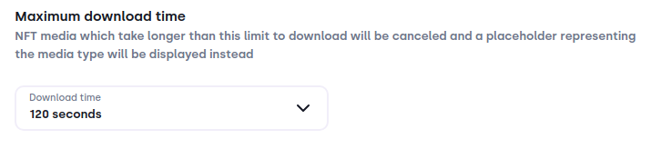
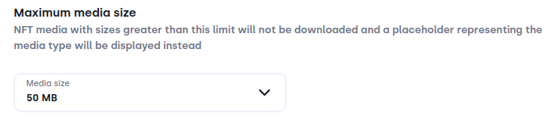
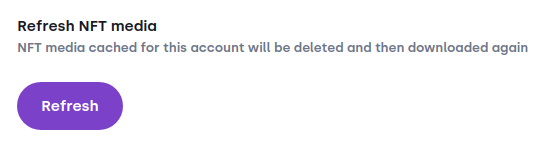

# Collectibles

### Maximum download time
:::image

:::

NFTs can contain a large amount of data that can take a very long time to download. Downloads happen sequentially, which means that if the first downloaded NFT takes too long, the next NFTs are not downloaded until the first is finished. 
If an NFT isn't downloaded because of this setting, you're still able to see the NFT by using the `Open media in browser` button.

### Maximum media size
:::image

:::

NFTs can contain a large amount of data, e.g. high resolution videos. Because Bloom stores all NFT media locally, it is recommended to set a upper limit for the media size, so that they don't take up too much space on your computer. 
If an NFT isn't downloaded because of this setting, you're still able to see the NFT by using the `Open media in browser` button.

### Refresh NFT media
:::image

:::

Sometimes it can happen that NFT media is downloaded incorrectly. If you suspect that something is wrong in your `Collectibles` tab, you can use the `Refresh` button to try to fix it. 