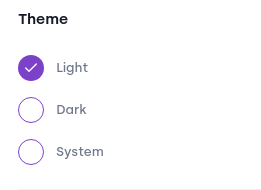
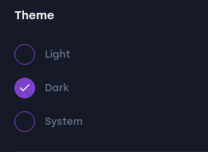
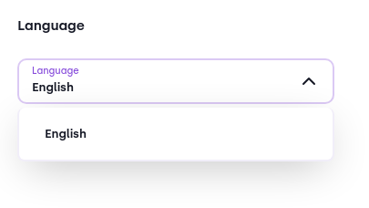

# General
These settings are applied to the **whole** application, across all profiles and wallets. 

### Theme
Specifies the app's theme.

##### Light mode:
:::image

:::

##### Dark mode:
:::image

:::

##### System mode:
The theme specified in your operating system's settings is applied to Bloom.

### Language
Specifies the language used across Bloom. If you cannot find your preferred language in Bloom's list, you can help us translating. 
Join our [Discord](https://discord.com/invite/RjX3jEc7K7) and take a look in our `🔡-translations` [channel](https://discord.com/channels/1106530660358828062/1174373868203425863)

:::image

:::

