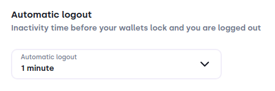
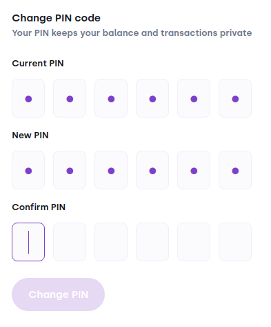
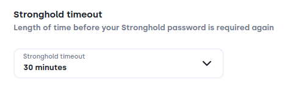
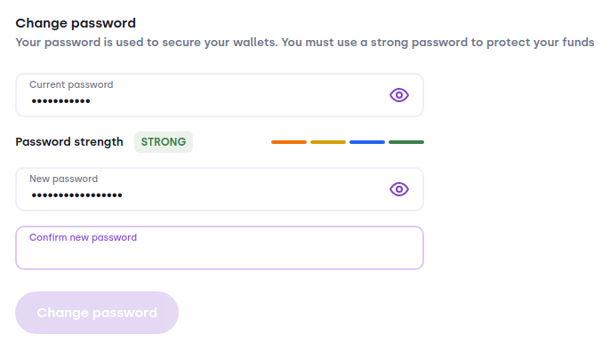

# Security

This section includes relevant settings to make your wallet use more secure.

### Profile
If a third person gets access to your computer and they know your PIN, they can log in to your profile. 
**Important**: Even though they know the PIN, they are not able to interact with your balance and NFTs.

#### Automatic logout
:::image

:::

If you have your wallet installed on a computer where  people can access it while you're away, and you want to keep your privacy, set the `Automatic Logout` to `1-5 minutes`. 

#### Change PIN
:::image

:::

If you suspect that a third person has received access to your PIN, change it ASAP to keep your profile private. 

### Stronghold
Stronghold is the technology Bloom uses to securely store your seed phrase. To use the seed phrase to e.g. sign transactions, the password is required.
**Important**: Keep your password safe so that only you can access your funds! If a third person gets access to it, your funds may be in danger.

#### Stronghold timeout
:::image

:::

If you have your wallet installed on a computer where  people can access it while you're away, it is recommended to set your `Stronghold timeout` to a short amount, i.e `1-5 minutes`. 

##### Change Password
:::image

:::

If you suspect that a third person has received access to your password, change it ASAP to minimize risk. 

