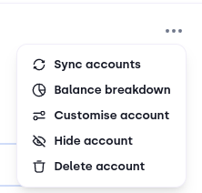

# Overview

After you log into your Bloom profile, you will see the Bloom Dashboard. The wallet tab is the default tab and contains the following components:

1. [Account Switcher](#1-account-switcher)
2. [Account Menu](#2-account-menu)
3. [Balance Summary](#3-balance-summary)
4. [Send Button](#4-send-button)
5. [Receive Button](#5-receive-button)
6. [Layer 1 Summary](#6-layer-1-summary)
7. [Layer 2 Summary](#7-layer-2-summary)
8. [Activity Tab](#8-the-activity-tab)
9. [Portfolio Tab](#9-the-portfolio-tab)

:::image

:::

### 1. Account Switcher

The Account Switcher indicates which account you currently view. Clicking on the switcher opens a dropdown that shows your available accounts with the corresponding balances. It also provides the option to create a new account.

:::image

:::

### 2. Account Menu

The Account menu allows you to provide actions related to your currently selected account. These are:

- Syncing accounts: a feature to find missing balances on higher address indices. *Mostly used for IOTA/Shimmer users that have been using Firefly v1.*
- Balance breakdown: a breakdown that shows you the allocation of your funds. It also includes a pop-up that allows you to consolidate your balance. Consolidation means to reduce your amount of outputs to free up storage deposit.
- Customise account: a pop-up that allows you to change your account name and the associated color.
- Hide/Unhide account: this option hides your account from the account switcher. You can show hidden accounts by enabling the hidden accounts setting in the Advanced Section of settings. By enabling this option, you can click this option to unhide the account.
- Delete account: removes your account from your profile. You can restore it using the wallet finder. *This option is not available for the first account.*

:::image

:::

### 3. Balance Summary

This part shows your available balance in fiat value. It sums up your L1 and L2 native token balances. You can change the currency under the settings menu.

### 4. Send Button

The send button opens the send flow. You can find more information about the different options [here](send-flow).

### 5. Receive Button

The receive button opens a pop-up that displays your different addresses for the networks Bloom supports.

:::image

:::

### 6. Layer 1 Summary

The Layer 1 summary contains the name of the network, your address, the total amount of tokens available with an associated fiat value. Additionally it also shows you the avatar of your native tokens and NFTs.

### 7. Layer 2 Summary

The Layer 2 summary contains the name of the network, your address, the total amount of tokens available with an associated fiat value. It also shows you the avatar of your native tokens and NFTs on L2. In case you don't have a L2 address yet, it includes a button brings you to the generate address flow.

### 8. The Activity Tab

The activity tab displays your recent account activities. The tab shows you the asset associated with the activity, the action, date, addresses and amount involved. It is possible to search and filter through your activities using the icons on the right side. Clicking on an activity opens the summary that provides you with additional information.

:::image

:::

### 9. The Portfolio Tab

You can reach the portfolio tab by clicking the Tab switcher above the activity tab.
The portfolio tab contains the tokens (base token and native tokens) you own. It provides information on which network it lives, the market capitalization and the market price from CoinGecko.

:::image

:::
