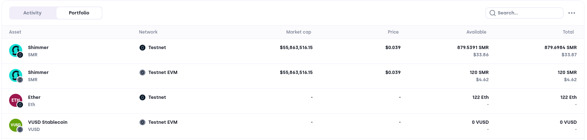
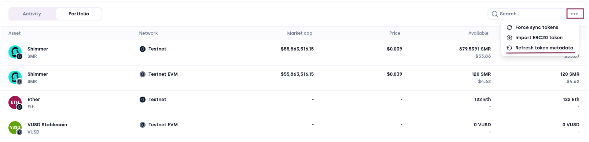

# Portfolio

Your portfolio contains your base tokens and native tokens on the different networks. You can search through them using the search bar on the top right. Additionally, you have a menu at the top right with additional actions, which are described below.

:::image

:::

### Force Sync Token

Bloom automatically fetches your Layer 2 balances every 10 seconds. Click on the `Force sync tokens` option to manually trigger the token syncing.

:::image

:::

### Import ERC-20 Token

Bloom tracks the user's ERC-20 tokens through the Layer 2 explorer API. However, the explorer isn't always real time, which is why Bloom offers the possibility to import an ERC-20 token through its contract address. Go to the portfolio tab and click on the menu to select the `Import ERC20 token`. This opens a pop-up that allows you to select the network and input the contract address.

**Only ERC-20 Tokens on the supported EVM networks are supported!**

:::image

:::

### Refresh Token Metadata

Bloom caches tokens and their metadata for performance reasons. If you want to delete the cached tokens and their metadata, and refetch them, click on the `Refresh token metadata` option. Once cleared, Bloom fetches the information from the corresponding network and caches them again.

:::image

:::
