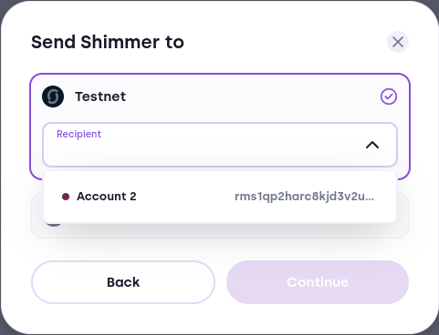
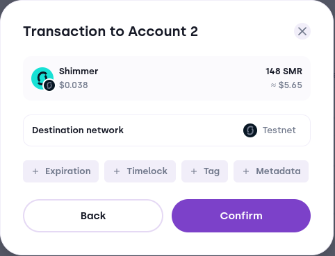

# Send Flow

There are multiple ways to enter the send flow. You can enter it through clicking the send button on the main dashboard, by clicking send on a given token or through a deep link. When you click the send button, it opens the token selection pop-up.

:::image

:::

### Token Selection

The token section serves to select the token you want to send. A search bar at the top of the pop-up helps you pick the token if you have many tokens. The tabs below allow you to view only the tokens on the given network. The token list consists of the base tokens and native tokens you own. The token avatar hints you from which network you can send them. The origin network will always equal to that of the token you want to send (e.g. Layer 2 Native Token will initiate a transaction from Layer 2).

:::image

:::

**In case you want to send NFTs, you should go to the Collectibles tab**.

### Destination Selection

Based on the token you select, different networks pop up. For the base token and native token both Layer 1 and Layer 2 network shows up, since Bloom supports transferring from one layer to another. You can select a contact or one of your own accounts, or you can paste another address in the input field.

:::image

:::

### Amount Selection

This section provides the means to set the amount you want to send. It also shows you your available balance and an option to set the amount to your available balance. The available balance shown might differ from the available balance under the portfolio tab, because Bloom subtracts the gas fee and/or the storage deposit automatically.

**Disclaimer: You won't be able to send your maximum Layer 1 SMR (or IOTA) balance minus ~50 000 base unit. You must have sufficient base token units left to cover the Storage Deposit Return Unlock conditions of the remainder output. This is a slight limitation of the UTXO output model and the storage deposit requirements.**

:::image

:::

### Storage Deposit

IOTA/Shimmer uses a concept of [storage deposit](https://wiki.iota.org/tips/tips/TIP-0019/). You need to attach sufficient base tokens to your transaction, to satisfy the deposit for the transaction. It is a mechanism to prevent spam and misuse of the network. This applies for all transactions
on Layer 1 (also transactions that send funds to Layer 2). Bloom calculates this amount using the SDK and ensures that the required conditions are satisfied.

### Gas Fee

On Layer 2, the EVM introduces the concept of a gas fee. It is an amount of computation unit spent to execute smart contract computations which the users pays in the base token. This amount is calculated from the gas price given by the node and the gas units required for the smart contract state change. The latter depends on which smart contract is called and what functions are invoked. The EVM that runs on Layer 2 doesn't support Storage Deposit Unlock Conditions, Expiration Time Unlock Conditions, and the other things that IOTA has implemented on Layer 1. 
(For Layer 1 to Layer 2 transactions, Bloom adds funds to the transaction to ensure enough base tokens are provided to cover both the gas fee and the storage deposit)

### Transaction Summary

After selecting the previous options, the transaction summary allows you to understand what your transaction will result into. It provides options to set additional features available for Layer 1 transactions, such as:

- Tag: indexable data attached to your transaction.
- Metadata: non-indexable data attached to your transaction.
- Timelock Unlock Condition: a condition that the receiver doesn't spend your transaction before a given time.
- Expiration Time Unlock Condition: a condition that ensures your transaction is returned to you, if the recipient doesn't claim it.
- Gift Storage Deposit: This removes the storage deposit return unlock conditions and attaches sufficient base token units to the transaction to satisfy the requirements of the Tangle.

**In certain cases, such as Layer 1 to Layer 2 transactions, deep links or proprietary transactions, one or more of these features is disabled.**

**Ensure to select the additional options before you send the transaction. Once you click confirm, you can't change the transaction anymore.**

:::image

:::

Bloom adds the estimated and the max gas fee for Layer 2 transactions. The estimated fee is just an estimation of the actual cost. The max fee is the upper limit the transaction is able to spend. Your balance needs to exceed the max gas fee balance in order for you to send the transaction.

:::image

:::

### Stronghold Unlocking

After clicking the confirmation button, Bloom will ask for the Stronghold password through a separate pop-up in case of a Software profile. Bloom skips the pop-up if you unlocked the Stronghold in the timeframe before the lock period.

### Ledger Unlocking

After clicking on the confirmation button, Bloom will guide you through the ledger confirmation flow for Hardware profiles. Once the Ledger device signs the transaction, Bloom sends it to the network.

### Layer 1 to Layer 1

The following steps allow you to transfer assets from **Layer 1 to Layer 1**:

1. Initiate the send flow
2. In the select asset pop-up, you select a **Layer 1 asset** you want to bridge
3. Click on Continue
4. Select the Layer 1 Network.
5. Input the Layer 1 address of the recipient.
6. Click on Continue
7. Select the amount you want to bridge
8. Click on Continue
9. Optionally add Layer 1 transaction features, such as tag, metadata, timelock, ...
10. Verify that the transaction details are correct
11. Click on Confirm

### Layer 2 to Layer 2

The following steps allow you to transfer assets from **Layer 2 to Layer 2**:

1. Initiate the send flow
2. In the select asset pop-up, you select a **Layer 2 asset** you want to bridge
3. Click on Continue
4. Select the EVM/Layer 2 Network.
5. Input the Layer 2 address of the recipient.
6. Click on Continue
7. Select the amount you want to bridge
8. Click on Continue
9. Verify that the transaction details are correct
10. Click on Confirm